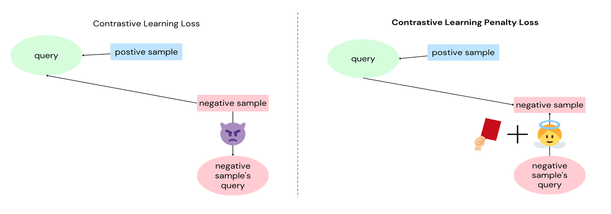

# Enhanced-BGE-M3-with-CLPL-and-MoE

This repository provides the code for applying Contrastive Learning Penalty Loss (CLPL) and Mixture of Experts (MoE) to the BGE-M3 text embedding model for enhanced information retrieval performance.

## Contrastive Learning Penalty Loss (CLPL)

CLPL is a novel loss function designed to address the limitations of existing contrastive learning methods for improved performance in information retrieval tasks. It incorporates a penalty term that encourages the model to learn more discriminative representations by considering the similarity between negative samples and their corresponding queries.

The CLPL loss function is defined as follows:

where:

* hi: The embedding of the query for the i-th instance.
* hi+: The embedding of the positive sample for the i-th instance.
* H': The set of negative samples for the i-th instance.
* h': The embedding of the negative sample's query.
* H*: the set of positive queries for the documents corresponding to the negative samples
* sim(a, b): The cosine similarity function between embeddings a and b.
* τ: The temperature parameter.
* λ: The balancing parameter between the contrastive loss and the penalty term.

The difference between Contrastive Learning Loss and Contrastive Learning Penalty Loss:

## Specs

- Model

| Model Name | Introduction |
|---|---|
| bge-m3-ko-CLPL-MoE | This model applies CLPL and MoE, trained on the MIRACL Korean training dataset |
| bge-m3-fa-CLPL-MoE | This model applies CLPL and MoE, trained on the MIRACL Persian training dataset |
| bge-m3-hi-CLPL-MoE | This model applies CLPL and MoE, trained on the MIRACL Hindi  training dataset |

- Data
  
Performing negative sampling using the ANCE methodology and generating negative sample's positive queries through the Gemini 1.5 Pro model, which are required for CLPL.

| Dataset | Introduction |
|---|---|
| [ko_CLPL_train_data](./data/ko_CLPL_train_data.jsonl) | MIRACL Korean CLPL training dataset |
| [fa_CLPL_train_data](./data/fa_CLPL_train_data.jsonl) | MIRACL Persian CLPL training dataset |
| [hi_CLPL_train_data](./data/hi_CLPL_train_data.jsonl) | MIRACL Hindi CLPL training dataset |
